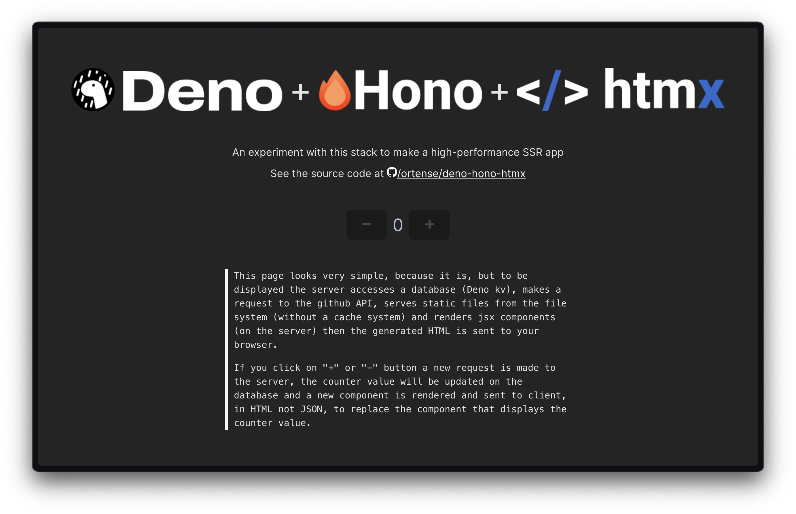
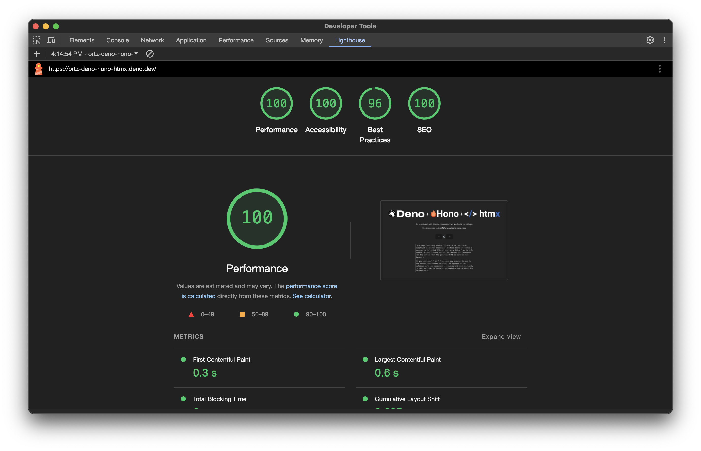
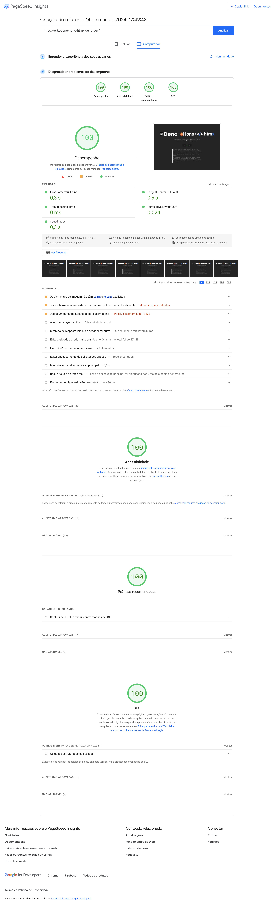

# Deno + Hono + htmx

An experiment with this stack to make a high-performance SSR app

Live demo at [ortz-deno-hono-htmx.deno.dev](https://ortz-deno-hono-htmx.deno.dev/)

First lighthouse results

